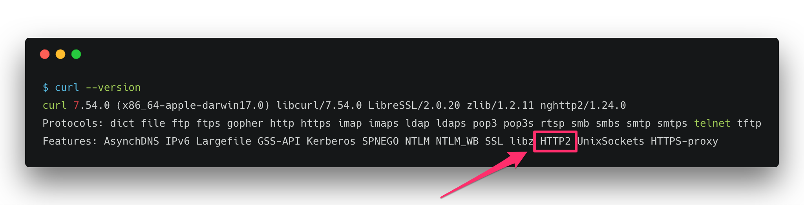

# Andpush [](https://travis-ci.org/yuki24/andpush)

Andpush is an HTTP client for FCM (Firebase Cloud Messaging). It implements [the Firebase Cloud Messaging HTTP Protocol](https://firebase.google.com/docs/cloud-messaging/http-server-ref).

The `andpush` gem performs **about 3.7x faster** than [the fcm gem](https://github.com/spacialdb/fcm) in a single-threaded environment.

**If you are thinking to send push notifications from Rails, consider using the [pushing gem](https://github.com/yuki24/pushing), a push notification framework that does not hurt.**

## Installation

Add this line to your application's Gemfile:

```ruby
gem 'andpush'
```

Or install it yourself as:

    $ gem install andpush

## Usage

You'll need your application's server key, whose value is available in the [Cloud Messaging](https://console.firebase.google.com/project/_/settings/cloudmessaging) tab of the Firebase console Settings pane.

```ruby
require 'andpush'

server_key   = "..." # Your server key
device_token = "..." # The device token of the device you'd like to push a message to

client  = Andpush.new(server_key, pool_size: 25)
payload = {
  to: device_token,
  notification: {
    title: "Update",
    body: "Your weekly summary is ready"
  },
  data: { extra: "data" }
}

response = client.push(payload)

headers = response.headers
headers['Retry-After'] # => returns 'Retry-After'

json = response.json
json[:canonical_ids] # => 0
json[:failure]       # => 0
json[:multicast_id]  # => 8478364278516813477

result = json[:results].first
result[:message_id]      # => "0:1489498959348701%3b8aef473b8aef47"
result[:error]           # => nil, "InvalidRegistration" or something else
result[:registration_id] # => nil
```

### Topic Messaging:

```ruby
topic   = "/topics/foo-bar"
payload = {
  to: topic,
  data: {
    message: "This is a Firebase Cloud Messaging Topic Message!",
  }
}

response = client.push(payload) # => sends a message to the topic
```

## Using HTTP/2 (Experimental)

The current GitHub master branch ships with experimental support for HTTP/2. It takes advantage of the fantastic library, [libcurl](https://curl.haxx.se/libcurl/). In order to use it, replace `Andpush.new(...)` with `Andpush.http2(...)`:

```diff
+# Do not forget to add the curb gem to your Gemfile
+require 'curb'

-client = Andpush.new(server_key, pool_size: 25)
+client = Andpush.http2(server_key) # no need to specify the `pool_size' as HTTP/2 maintains a single connection
```

### Prerequisites

 * [libcurl](https://curl.haxx.se/download.html) 7.43.0 or later
 * [nghttp2](https://nghttp2.org/blog/) 1.0 or later

**Make sure that your production environment has the compatible versions installed. If you are not sure what version of libcurl you are using, try running `curl --version` and make sure it has `HTTP2` listed in the Features:**



**If you wish to use the HTTP/2 client in heroku, make sure you are using [the `Heroku-18` stack](https://devcenter.heroku.com/articles/heroku-18-stack). Older stacks, such as `Heroku-16` and `Cedar-14` do not ship with a version of libcurl that has support for HTTP/2.**

If you are using an older version of libcurl that doesn't support HTTP/2, don't worry. It will just fall back to HTTP 1.1 (of course without header compression and multiplexing.)

## Performance

The andpush gem uses [HTTP persistent connections](https://en.wikipedia.org/wiki/HTTP_persistent_connection) to improve performance. This is done by [the net-http-persistent gem](https://github.com/drbrain/net-http-persistent). [A simple benchmark](https://gist.github.com/yuki24/e0db97e887b8b6eb1932c41b4cea4a99) shows that the andpush gem performs at least 3x faster than the fcm gem:

```sh
$ ruby bench.rb
Warming up --------------------------------------
             andpush     2.000  i/100ms
                 fcm     1.000  i/100ms
Calculating -------------------------------------
             andpush     28.009  (± 7.1%) i/s -    140.000  in   5.019399s
                 fcm      7.452  (±13.4%) i/s -     37.000  in   5.023139s

Comparison:
             andpush:       28.0 i/s
                 fcm:        7.5 i/s - 3.76x  slower
```

## Contributing

Bug reports and pull requests are welcome on GitHub at https://github.com/yuki24/andpush. This project is intended to be a safe, welcoming space for collaboration, and contributors are expected to adhere to the [Contributor Covenant](http://contributor-covenant.org) code of conduct.

## License

The gem is available as open source under the terms of the [MIT License](http://opensource.org/licenses/MIT).
